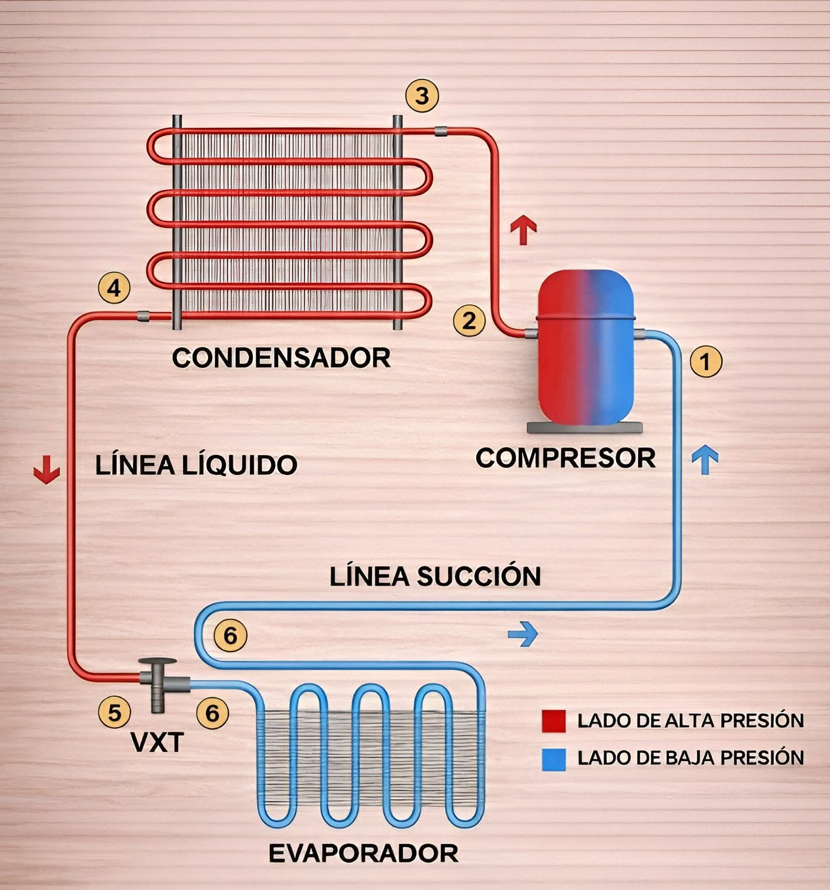
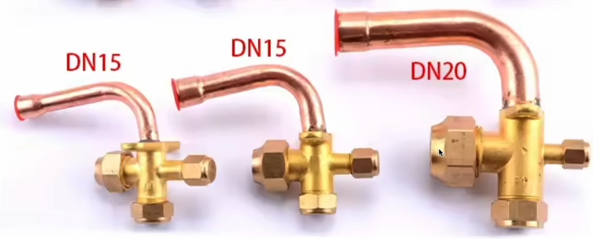
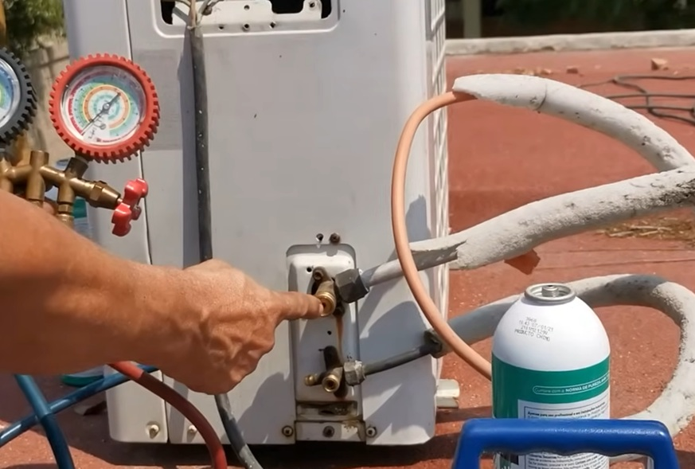

# Teoría del funcionamiento de un mini-split

### Componentes del equipo de aire acondicionado:

* El minisplit tiene dos unidades, la unidad exterior y el split que es la unidad interior.
* Tiene dos tuberías, la gruesa es la de **succión** y la delgada es la de **descarga**.
* Componentes principales:
    * En la unidad exterior:
        * Compresor: comprime el refrigerante (gas->gas).
        * Condensador: transforma el refrigerante de gas a líquido (gas->líquido).
        * Válvula de expansión: convierte el refrigerante de alta presión y alta temperatura a baja presión y baja temperatura (líquido->líquido).
    * En la unidad interior:
        * Evaporador: convierte el refrigerante de líquido a gas (líquido-gas).

**NOTA**: la válvula de expansión generalmente está en la unidad exterior, pero a veces está en la unidad interior.

### Flujo del refrigerante en el sistema

El ciclo del flujo del refrigerante en el sistema es el siguiente:

* Es un ciclo, pero comenzaremos en la **válvula de succión** (la gruesa) de la unidad exterior. En este punto el refrigeranate está en estado gaseoso.
* De la válvula, el refrigerante pasa al compresor el cual succiona el refrigerante a baja presión y a baja temperatura. Comprime el refrigerante y lo expulsa a alta presión y a alta temperatura, pero sigue quedando en estado gaseoso.
* Este gas entra al condensador que consiste de todo el recorrido de la tubería que pasa frente al ventilador de la unidad exterior, el ventilador es parte del condensador. En algún punto intermedio el refrigerante cambia a estado líquido (condensa el gas). Y sale del condensador a alta presión y a alta temperatura.
* Del condensador entra a la válvula de expansión, esta válvula convierte el refrigerante a baja presión y a baja temperaturaa, pero sigue en estado líquido.
* De la válvula de expansión llega a la **válvula de descarga** (la delgada) de la unidad exterior. Aquí sigue en estado líquido a baja presión y baja temperatura.
* De la válvula de descarga, el refrigerante llega al evaporador que se encuentra en la unidad interior, que consiste en el recorrido de la tubería que pasa frente a la turbina. En algún punto intermedio del evaporador, el refrigerante cambia de líquido a gaseoso a baja presión y baja temperatura.
* De aquí el refrigerante vuelve a la válvula de succión y el ciclo se repite constantemente.

De forma simplificada, el diagrama sería el siguiente: 

```
válvula de succión -> compresor -> condensador (gas->líquido) -> válvula de expansión -> válvula de descarga -> evaporador (líquido->gas) -> se repite el ciclo.
```




Las tuberías, en la conexión con el compresor se tienen válvulas de 3 vías:
* La válvula está soldada a una tubería que conecta con el **condensador**.
* Respecto a las 3 vías (que no están soldadas), una se conecta a una tubería que lleva al **evaporador**, otra es la vía de servicio donde se conectan las mangueras del manómetro y la otra contiene una llave allen que se abre o se cierra para liberar o retener el gas.
* Por la vía de la llave no entra ni sale nada nunca, esté abierta o cerrada, solamente controla si el gas entra al compresor en el caso de la válvula de succión (tubería gruesa) o sale hacia el evaporador en el caso de la válvula de descarga (tubería delgada).

    
    