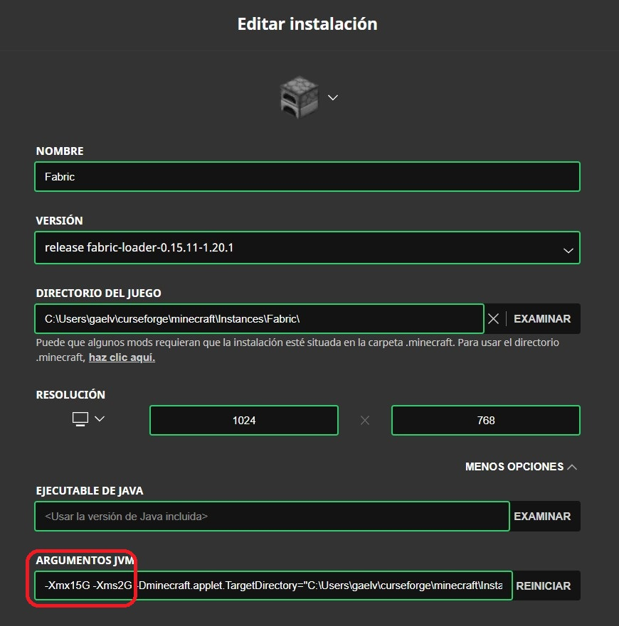

Manejador de Modpacks `CurseForge`
-----------------------------------
https://www.curseforge.com/download/app

Recordemos que Minecraft no está diseñado para soportar Mods, sino que necesitamos instalar un Mod Loader como está documentado en la documentación de Mods. A continuación tenemos las consideraciones más importantes que hacen difícil trabajar directamente con el Launcher de Minecraft:

* Existen varios mod Loaders, los principales siento `Forge` y `Fabric`, aunque recomiendo darle preferencia a Fabric por tener mucho mejor rendimiento a un crecimiento acelerado.
* Podemos instalar perfiles de distintas versiones de Minecraft con el Mod Loader que queramos.
* El Launcher de Minecraft solo nos permite cambiar de perfil, pero la carpeta de Mods y de Shaders es la misma, por lo que tendríamos que manejar manualmente una carpeta de mods y de shaders para cada perfil que tengamos, y cuando cambiemos de perfir hacer renombrado manual de estas carpetas.

Este manejador de Modpacks nos resuelve este problema, ya que se encarga de administrar distintos perfiles de Minecraft junto con sus Mods, shaders y el respectivo Mod Loader. Algo así como entornos virtuales. A estos se les llama Modpacks y son independientes entre sí.

Este manejador fue desarrollado por `curseforge` que es el principal provedor de Mods para los distintos Loaders, por lo que tenemos a la mano todos casi todos los Mods existentes para los distintos Loades.

Al abrir la aplicación encontraremos la sección de `My Modpacks` donde podremos crear un Modpack nuevo elegir la versión de Minecraft y del Mod Loader. Una vez crado podremos añadirle ahí mismo los mods y shaders que queramos. Además nos simplifica un poco el trabajo ya que automáticamente genera filtros donde solo nos aparecerán Mods que son compatibles con la versión de Minecraft usada en el Modpack. 

Aún con todo esto, no resuelve el problema de la incompatibilidad entre Mods, nos toca estar haciendo pruebas, pero sí nos provee una facilidad para esto, ya que cada Modpack tiene su sección de Mods donde con un click podremos habilitar y deshabilitar los Mods que tengamos instalados.

### Optifine para el Loader Forge

Para poder usar shaders con el Loader Forge, necesitamos instalar el Mod [Optifine](https://optifine.net/downloads), el problema es que este Mod no puede ser instalado directamente con el manejador ya que los desarrolladores de Optifine parecen querer distribuir el Mod por ellos mismos.

Aún así lo podemos instalar en un Modpack manualmente, para esto tenemos que bajar Optifine para la versión de Minecraft y de Forge correspondiente. Por esta razón yo recomiendo primero revisar para que versiones del Loader Forge está disponible Optifine y crear el Modpack usando esta versión específica de Forge. Si ya existe el Modpack podemos probar suerte con la versión más actual soportada por Optifina para la versión de Minecraft usada en el Modpack.

Una vez descargado el archivo `jar` correspondiente al Minecraft y al Forge del Modpack, abrimos la carpeta del Modpack, que se puede conseguir desde la aplicación `CurseForge` abriendo el Modpack, dando clic en los 3 puntos verticales que indican más opciones y elegir `Open Folder`, como en la imagen.

    

Una vez abierta la carpeta, solo ponemos el `jar` de optifine dentro de la subcarpeta `mods` y listo, deberíamos ver el mod en la sección de los Mods del Modpack bajo un nombre como `project-<algún_numero>`.

### Consideraciones

Para iniciar Minecraft desde un Modpack, solo hay que dar clic en `Play`, lo cual nos abrirá una versión diferente del Minecraft Launcher que solo contendrá el perfil correspondiente al Modpack, aprovechar y de una vez definir más memoria RAM editando el perfil:

    

Una vez en el modo de edición, hacemos clic en `MAS OPCIONES` y en el campo `ARGUMENTOS JVM` podemos definir el mínimo de RAM con el parámetro `-Xms<tamaño>` y el máximo con `-Xmx<tamaño>`, el tamaño es un número y una letra, si la letra es `M` se usarán Megabytes, si es `G` se usarán Gigabytes.

    

