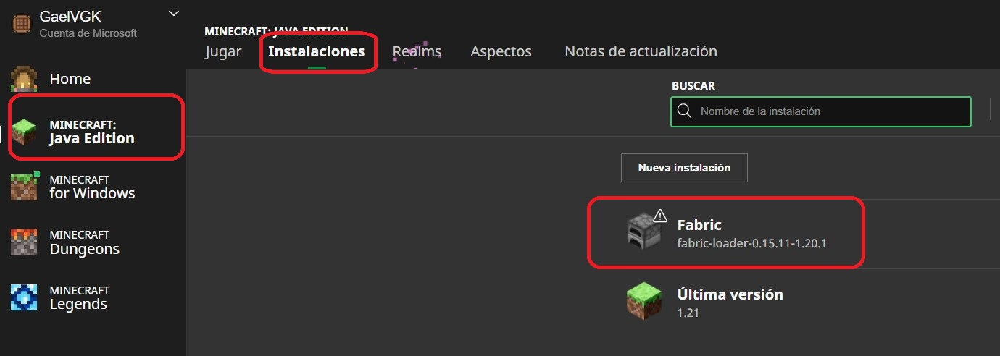

Minecraft Mods (actualizado a Jul/2024)
---------------

En Minecraft, podemos instalar mods pero solo en la versión de Java. En este documento documentaré lo aprendido respecto a este tema.

### Mods Loaders

Por sí solo, Minecraft no soporta mods, para que esto sea posible la comunidad ha desarrollado distintos Mods Loaders (cargadores de mods). Cada uno tiene su propia API de integración y por lo tanto un mod solo puede funcionar en un Loader si se realizó la adaptación correspondiente. Los dos principales Loaders que dominan el escenario son:

* [Forge](https://files.minecraftforge.net/net/minecraftforge/forge/): un Loader muy antiguo que tiene muchísimos mods pero que no está bien hecho, tiene muchos problemas serios de rendimiento y hace que Minecraft tenga problemas de velocidad aunque sea con máquinas potentes. También los desarrolladores encuentran difícil actualizar los mods en este Loader y por lo tanto tardan mucho en ser actualizados para las versiones recientes de Minecraft.
* [Fabric](https://fabricmc.net/): un loader más reciente, del 2018, que va despegando muy bien, tiene muchísimo mejor rendimiento y en mi experiencia funciona muy bien. El detalle es que tiene menos mods que Forge pero mi recomendación es darle prioridad a este Loader ya que se siente muy bien hecho y se espera que los mods más importantes de Forge no tarden en adaptarse para este Loader.

Al instalar alguno de los loaders, necesitamos especificar para qué versión de Minecraft queremos que se instale, ya que esto crea un perfil de Minecraft que contiene la versión elegida y el Loader. Creo que podemos elegir también la versión del Loder que queremos, por si alguno de los mods que queremos usar requiere alguna versión específica. 

Lo bueno es que podemos instalar Loaders para tantas versiones de Minecraft como queramos, solo que tendremos que ejecutar el instalador cada vez. Los perfiles generados los encontraremos en el Minecraft Launcher.

    

Una recomendación aquí es editar el perfil e incrementar el máximo de memoria RAM que pueda utilizar:

    

Una vez en el modo de edición, hacemos clic en `MAS OPCIONES` y en el campo `ARGUMENTOS JVM` podemos definir el mínimo de RAM con el parámetro `-Xms<tamaño>` y el máximo con `-Xmx<tamaño>`, el tamaño es un número y una letra, si la letra es `M` se usarán Megabytes, si es `G` se usarán Gigabytes.

    

### Mods

Una vez instalado un Mod Loader, podemos instalar mods implementados para dicho loader. Esto es tan sencillo como descargar el archivo `jar` del mod y ponerlo en la carpeta `mods` de minecraft, que suele estar en `"C:\Users\<usuario>\AppData\Roaming\.minecraft"`. 

Un comentario importante es que como Minecraft por sí solo no maneja Mods, pues tenemos que hacer nuestros malabares si queremos mantener más de un conjunto de Mods, ya que aunque podemos elegir un perfil diferente con un Loader diferente, siempre se usa la misma carpeta de Mods. Lo que podríamos hacer es estarle cambiando el nombre a la carpeta de Mods cada que vayamos a cargar un perfil diferente. Esto la verdad es un poco complicado por lo que yo ampliamente recomiendo mejor instalar un Manejador de Modpacks como [Curseforge](https://www.curseforge.com/download/app). En este mismo directorio debería existir una archivo con documentación de CurseForge.

Hay varios lugares desde donde descargar mods, pero lo más reconocidos son los siguientes:

* [modrinth](https://modrinth.com/mods): es una plataforma de mods bien diseñada que maneja directamente un historial de versiones de cada Mod, donde se indica la versión de Minecraft necesaria.
* [curseforge](https://www.curseforge.com/minecraft/search?page=1&pageSize=20&sortBy=relevancy): una plataforma que parece ser que en un principio estaba enfocada en el Loader Forge, pero que ahora es genera para todos los Loaders. No se siente tan bien diseñada como `modrinth`.

### Shaders

Los Shaders son una especie de Mods, aunque no se les denomina así, los cuales están encargados de cambiar completamente el apartado visual de Minecraft. Existe gran variedad de shaders que van desde simples y caricaturescos hasta realistas.

El punto importante aquí es que para que los shaders funcionen se tiene que instalar un Mod específico en cada Loader, a continuación describo el de Fabric y el de Forge:

* `Forge`: para este loader se requiere el Mod [optifine](https://optifine.net/downloads), el problema con este mod es que parece que los desarrolladores quieren manejarlo aparte de todo y no está integrado en ninguna plataforma de Mods, solo en la web oficial. 
    * Una complicación añadidad con este mod es que para que funcione bien, se tiene que descargar la versión que corresponda a la versión de Forge. Ahí en la web oficial en la tabla de descargas está indicado cuales son las versiones correspondientes de Minecraft y Forge.
    * Al no estar integrado en plataformas de Mods, pues no se puede instalar directamente usando manejadores de Modpacks como `Curseforge`, en este caso uno tiene que bajar el Mod y poner el archivo `jar` en la carpeta `mods` del modpack.
* `Fabric`: para este loader se requiere el mod [iris](https://modrinth.com/mod/iris), en este caso la cosa se simplifica porque el Mod sí está integrado en plataformas de Mods y además no depende de una versión específica del Loader. Por estas razones este mdos se puede instalar directamente usando manejadores como `Curseforge`.

Una vez instalado el mod que corresponda a los shaders, ya podremos integrar shaders poníendolos en la carpeta `shaderpacks` de donde está instalado miecraft, que suele estar en `"C:\Users\<usuario>\AppData\Roaming\.minecraft"`. 

En este caso ocurre lo mismo que con los mods, que esta carpeta se usa siempre aunque cambiemos de perfil, por lo que tendríamos que tener una carpeta para cada perfil de mods y cambiar el nombre de la carpeta cada que vayamos a cargar un perfil diferente, por lo que recomiendo mejor usar el manejador de Modpacks `Curseforge`.

### Consideraciones:

* Los mods, los shaders, los loaders y el Minecraft mismo tienen una dependencia muy fuerte que no termina de resolverse de manera correcta en ningún lado, sin mencionar la compatibilidad entre mods.
* Uno mismo tiene que revisar manualmente qué mods quedan con qué versión de Minecraft y, en el caso de Forge, a veces del Loader.
* Aquí lo recomendable es primero revisar cual es la versión de Minecraft máxima que tiene soporte para todos los Mods que queremos instalar, una vez encontrada, descargamos las versiones de los Mods que correspondan a la versión de Minecraft.
* Con todo esto es probable que algunos Mods no sean compatibles entre sí y por lo tanto lo mejor es irlos agregando y probando uno por uno para depurar, y si queremos encontrar las incompatibilidades exactas pues habría que probar cada Mod contra todos los demás, obviamente usando alguna estrategia que se nos ocurra para redurcir el trabajo.
